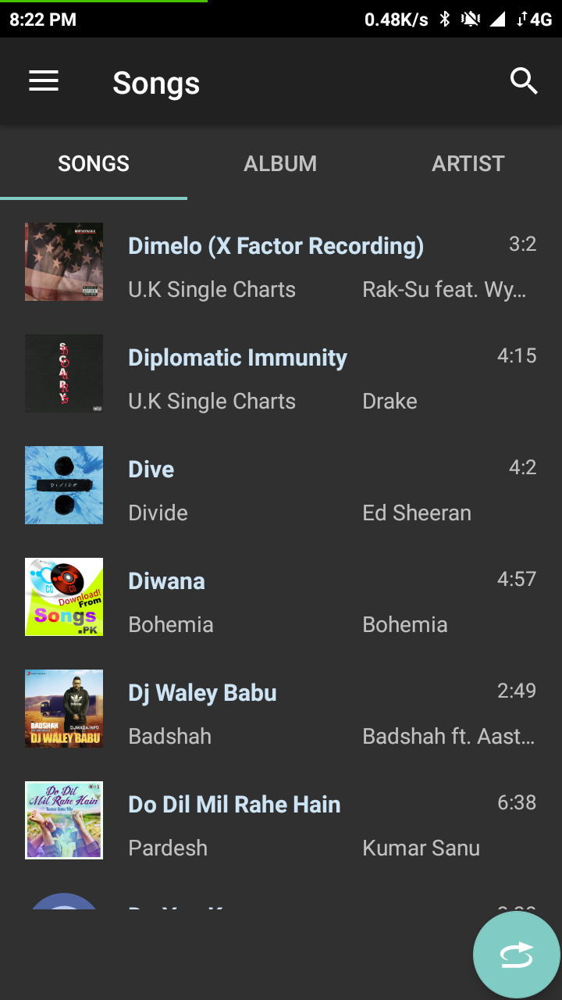
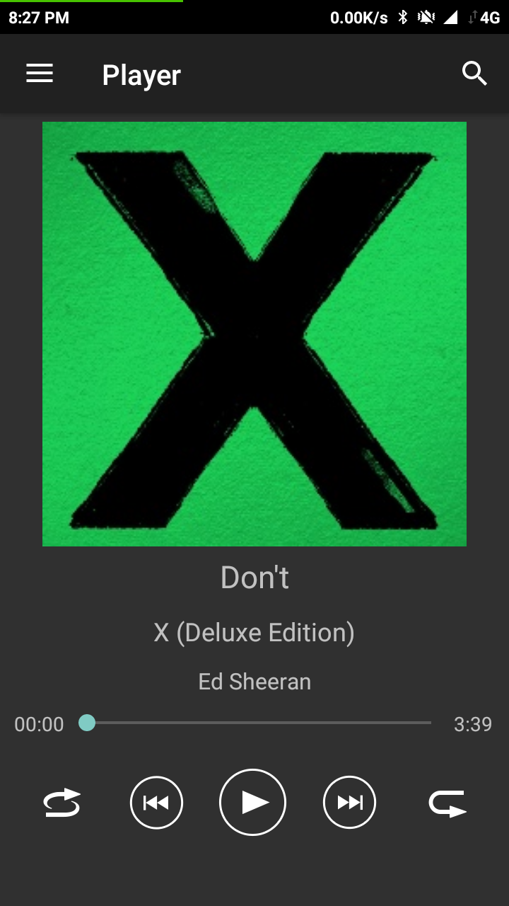
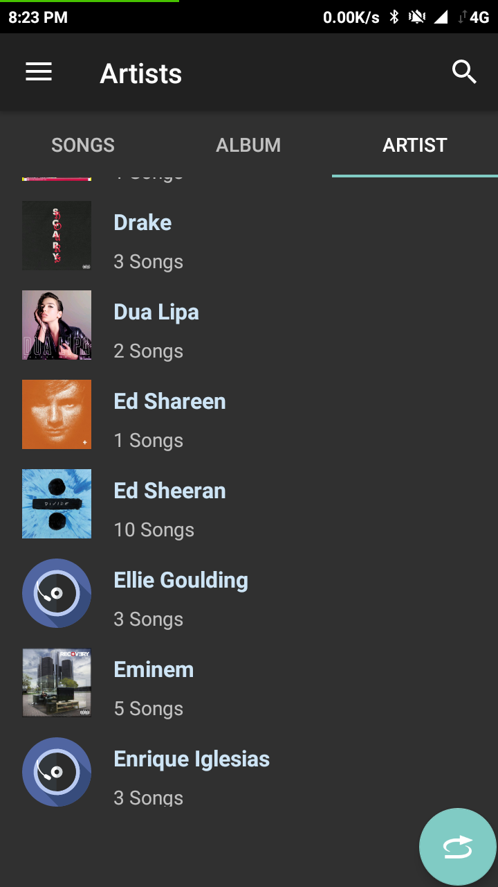
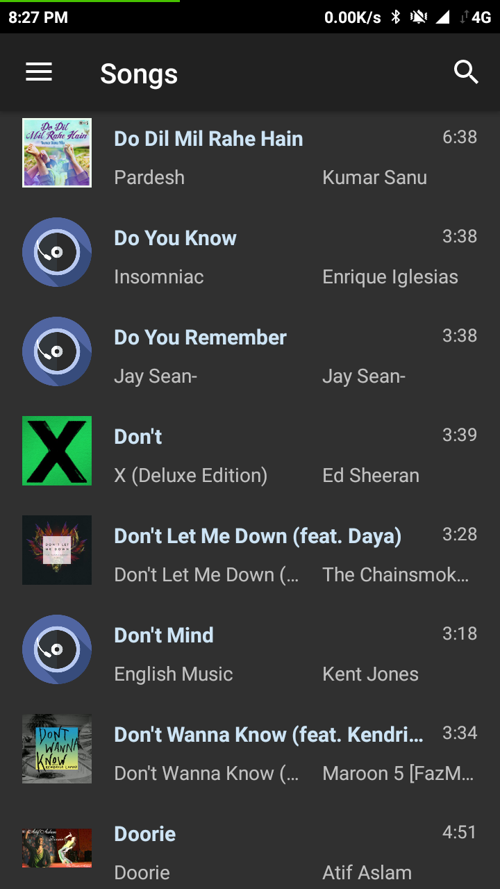
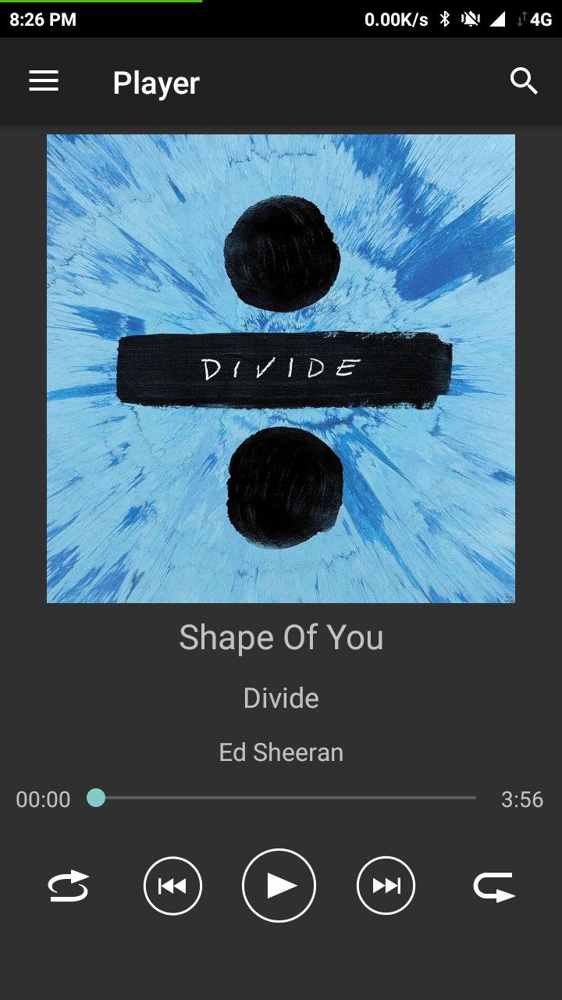
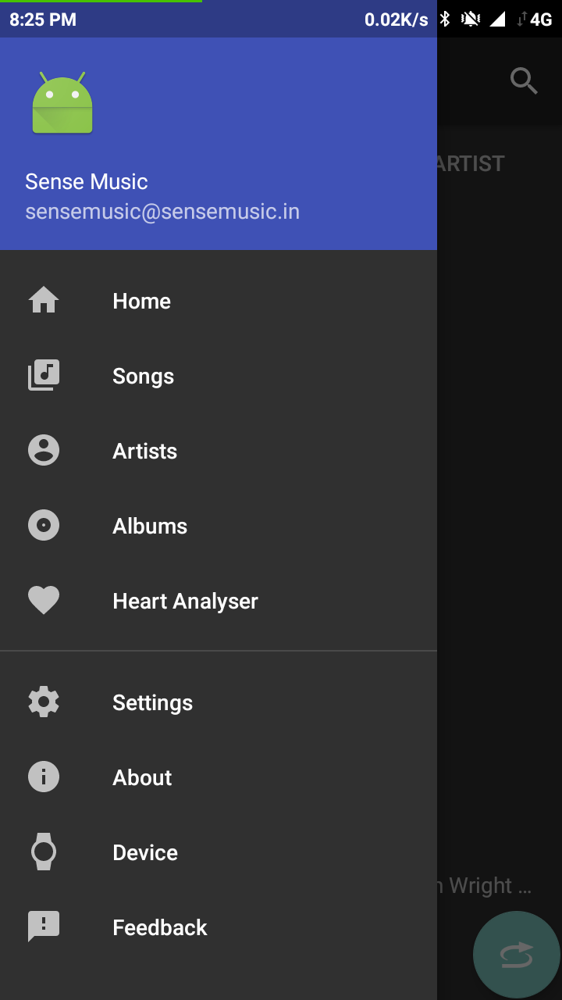

AudioPhile
===========================
Current version: 1.0

The goal of this project is to implement an audio media app that works
across multiple form factors and provide a consistent user experience
on Android devices.

<!-- Screenshots
-----------

 -->

Features
--------

Release v1.0:
* Simple audio focus management
* Expandable bottom panel
* Clicking "played song info" opens the artist details
* Long click on skip prev button enables repeat song 1x
* Expand the panel to show settings
* Dynamic shuffle 
* System equaliser (if present on the device)
* Dark and light themes + 16 accents
* Enable/disable search bar
* Indicator fast scroll 
* Search bar
* Open audio files from outside the app
* Pause/resume when the headsets are (dis)connected

Coming Soon
- Moduler Application Design with single Activity and swaping fragments.
- Firebase integration
- ML integration for heartbeat based mood detection
- login/profile integration for user-user customisation of app

Pre-requisites
--------------

- [Android Studio 3.x](https://developer.android.com/studio/index.html)
- A Java compiler compatible with Java 1.8
- The Android SDK with platform 29 installed which comes default with [Android Studio Bundle](https://developer.android.com/studio/index.html)

